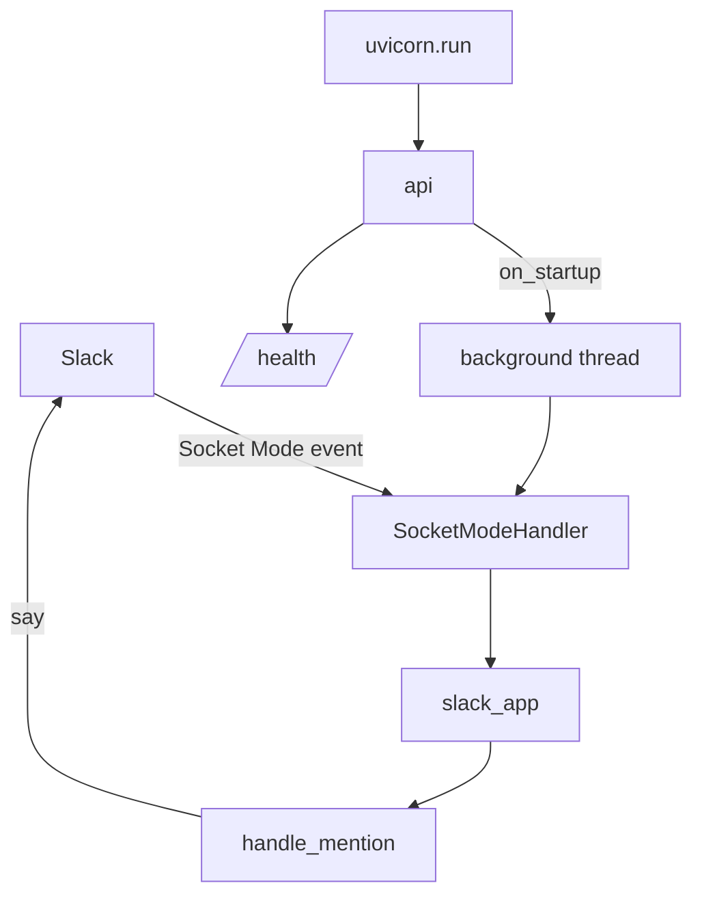

# Architecture

## System shape
| Unit | Role | Owns |
|------|------|------|
| `main.py` — `slack_app` | Slack Bolt app | Slack event handling (`app_mention`) |
| `main.py` — `api` | FastAPI app | HTTP surface (`/health`) |
| Background thread | Runs `SocketModeHandler.start()` | The persistent Slack Socket Mode connection |

## Runtime architecture

## Module responsibilities
| Module | Owns | Must not touch |
|--------|------|----------------|
| `main.py` | Bootstrap: env loading, Slack app, FastAPI app, thread startup | Should not grow indefinitely — split into modules (`handlers/`, `detectors/`, `canvas/`) once real detection logic is added |

## Boundary rules
- Secrets load once via `load_dotenv()` at import time; no module should read `os.environ` directly for Slack tokens elsewhere — pull from the already-validated `BOT_TOKEN`/`APP_TOKEN`/`SIGNING_SECRET` constants.
- Slack event handlers must ack/return quickly; long-running work (LLM calls, Canvas writes) must not block the handler thread.

## Critical flows
1. Process boot → `load_dotenv()` → validate tokens → construct `slack_app` → construct `api` → `uvicorn.run`.
2. `on_startup` → spawn daemon thread → `SocketModeHandler(slack_app, APP_TOKEN).start()` (blocks forever in that thread).
3. Slack `app_mention` event → `handlers/retrieval.py`'s `handle_mention` → if text contains "why", background thread calls `assistant.search.context` with the event's `action_token` and replies in-thread with ranked permalinks; otherwise replies with a usage hint.
4. HTTP `GET /health` → `{"status": "ok", "service": "recorder-bot"}`.

## Known architectural risks
- The Socket Mode connection runs in a daemon thread with no supervision — if `handler.start()` raises or the connection drops permanently, nothing restarts it and `/health` will keep reporting fine even though the bot is dead. Add a watchdog before relying on `/health` as a liveness signal for the Slack side.
- `main.py` is a single file; per `docs/Intitial-research.md`, upcoming layers (classifier, Canvas writer, verifier) should live in separate modules rather than being appended here.

## Planned module split (per milestone — see `PRD.md` Roadmap)
| Milestone | New module | Owns | Must not touch |
|-----------|-----------|------|----------------|
| M0 | (none — config only) | Agents & AI Apps scopes, `action_token` test call | — |
| M1a | `classifier.py` | Gemini call: message text → decision/commitment/none + confidence | Never persists message text itself |
| M1a | `canvas.py` | `canvases.create`/`canvases.edit`/`canvases.sections.lookup` — writes pointer records only | Must reject any write containing raw message text or an LLM-generated sentence |
| M1a | `handlers.py` | `message`/`app_mention` listener → classifier → ephemeral Block Kit confirm → on confirm, `canvas.py` write | Long-running work (Gemini call, Canvas write) must not block the ack |
| M1b | `retrieval.py` | **Implemented.** `/why` flow: `app_mention` → `action_token` → `assistant.search.context` → ranked permalinks | Cannot be called outside an event payload that carries an `action_token`; never reads the `content` field |
| M2 | `verifier.py` | **Implemented.** Scheduled follow-up, evidence search + NLI entailment, status updates on pointer records | Only ever nudges privately; never posts publicly on behalf of a user |

Each new module is added only when its milestone starts — don't scaffold ahead of the current milestone (see Code Rules in `CONSTITUTION.md`).
