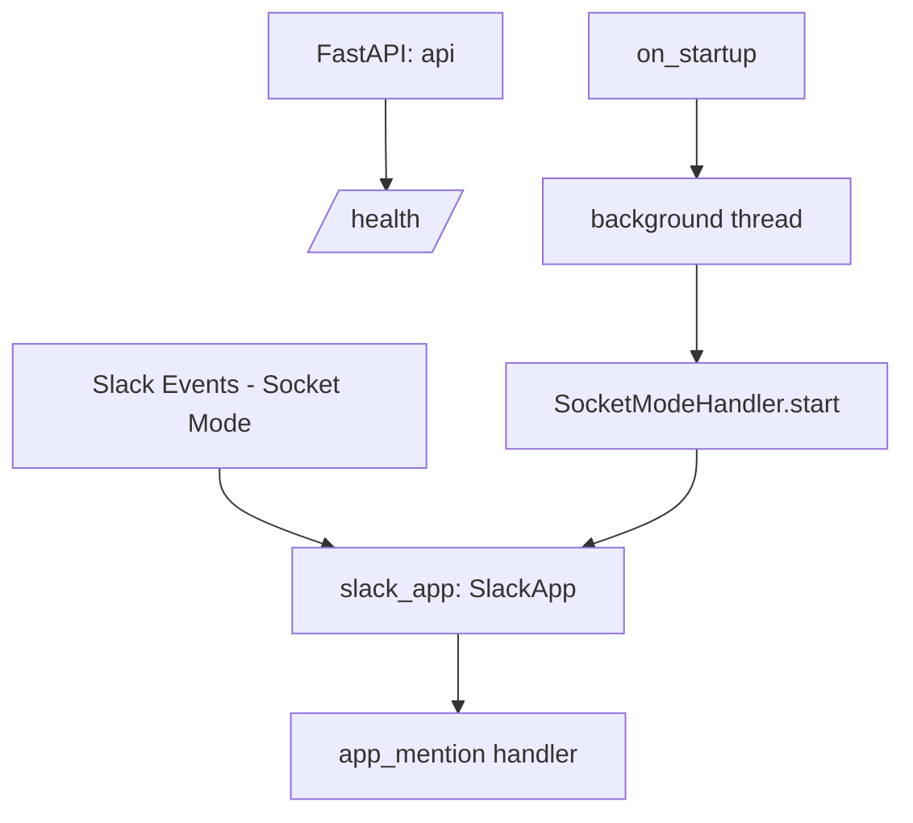

# CONSTITUTION.md

## Project Overview
- Product: Recorder — a transparent, peer-toned Slack agent that captures decisions, commitments, and blockers at the moment they're spoken, and later verifies whether they were followed through.
- Users: Teams working in Slack who lose rationale/decisions to scattered threads and wikis that "go to be forgotten."
- Problem: ADRs/Confluence/Notion fail because capture is a separate destination task divorced from where work happens. Recorder captures in-flow and retrieves in-flow (`/why [topic]`).
- Phase: M0 (platform de-risk) — starter bot (`app_mention` → "hello") is done and proved the Slack↔FastAPI chain; next up is enabling Agents & AI Apps + RTS scopes on the sandbox before any detection logic lands. Full milestone plan: `PRD.md` Roadmap, snapshots in `.claude/plans/milestones.md`.
- Build context: hackathon, 10-day budget — optimize for one complete demoable loop (M1a+M1b) over incremental safety; cut M2/M3 first if time runs short.

## Architecture North Star
A single Python process runs two things concurrently: a Slack Bolt app in Socket Mode (background thread) and a FastAPI web server (main thread, currently just `/health`). Slack events arrive via Socket Mode, not HTTP webhooks. Future layers (per `docs/Intitial-research.md`) will add: an LLM-based decision/commitment classifier on incoming messages, an ephemeral Block Kit confirm step, an evidence-only Slack Canvas as the pointer store, and a closed-loop verifier that checks later messages against open commitments.



## Tech Stack
| Area | Technology | Version | Purpose |
|------|-----------|---------|---------|
| Language | Python | 3.14 (venv) | Runtime |
| Web framework | FastAPI | 0.115.0 | HTTP server, `/health` |
| ASGI server | uvicorn | 0.30.6 | Runs the FastAPI app |
| Slack SDK | slack-bolt | 1.20.1 | Slack event handling, Socket Mode |
| Config | python-dotenv | 1.0.1 | Loads `.env` secrets |
| LLM | google-genai (Gemini) | TBD — add when M1a starts | Decision/commitment classifier |

## Commands
```bash
# Install:    pip install -r requirements.txt
# Dev:        python main.py
# Build:      N/A (interpreted, no build step)
# Lint:       N/A — not configured yet
# Typecheck:  N/A — not configured yet
# Test:       N/A — not configured yet
```

## Project Structure
```
main.py              — entrypoint: Slack Bolt app + FastAPI app + Socket Mode bootstrap
requirements.txt      — pip dependencies (unpinned lock)
.env / .env.example   — Slack secrets (SLACK_BOT_TOKEN, SLACK_APP_TOKEN, SLACK_SIGNING_SECRET)
docs/                 — product research (Intitial-research.md: full product/UX/architecture brief)
.claude/plans/milestones.md — the M0-M3 milestone plan + live status snapshots
venv/                 — local virtualenv (not committed logic)
```

## Code Rules
### General
- Scope changes to the current milestone (see `PRD.md` Roadmap / `.claude/plans/milestones.md`) — never pull in work from a later milestone "while you're in there."
- Match existing patterns in `main.py` (plain functions, module-level Slack/FastAPI app objects — no framework classes invented yet).
- No new libraries without checking `docs/Intitial-research.md` first (it already names the intended libraries/APIs for each future layer — Slack Canvas API, RTS `assistant.search.context`, NLI models, embeddings). LLM calls use Gemini (`google-genai`), not Claude/OpenAI — this was a deliberate hackathon-budget choice, don't swap providers mid-build.
- Update `.claude/reference/` when the event contract, API surface, or Slack scopes change.
- Add tests proportional to risk — glue/bootstrap code stays untested; the classifier, Canvas pointer schema, and verifier logic (M1a onward) require a test per `.claude/reference/testing.md`.
- Given the 10-day hackathon budget: prefer the smallest change that completes the current milestone's demo story over a more "correct" but slower general solution.

### Slack-specific (from `docs/Intitial-research.md` — read before touching event handling)
- Build as an **internal** Slack app. Never call `conversations.history`/`conversations.replies` in a loop or for backfill — Tier 1 rate limits (1/min) apply to non-internal/non-Marketplace apps. Process events live via the Events API instead.
- The Canvas (once implemented) stores **pointers only**: `channel_id`, message `ts`, permalink, detected type, owner `user_id`, confidence, status. Never store raw message text or an LLM-generated summary in the Canvas.
- `/why` retrieval must go through `assistant.search.context` (Real-time Search), which requires an `action_token` obtained from an event payload (`app_mention`/`message.im`) — it cannot be called with a bare bot token or from a slash command handler.
- Interaction payloads (shortcuts/modals/button clicks) must be acknowledged within 3 seconds; `trigger_id` is single-use and expires in 3 seconds. Ack first, then do LLM/detection work asynchronously.

## GitHub Workflow
- Issues → PRs → merge.
- Branch naming: `feat/`, `fix/`, `chore/`, `docs/`.
- PR title: Conventional Commits format.
- Required checks: `.github/workflows/ci.yml` (installs deps + `python -m py_compile main.py` syntax check) — expand once lint/test tooling is added.
- No direct push to `main`.

## Team
| Role | Handle | Owns |
|------|--------|------|
| UNKNOWN | UNKNOWN | UNKNOWN — fill in when team expands beyond solo build |

## Validation Gate
```bash
python -m py_compile main.py   # syntax check (safe without .env — `import main` would raise, since module-level code requires Slack env vars)
python main.py                 # manual smoke test with real .env — confirm /health responds and app_mention replies
```
No automated lint/typecheck/test command exists yet. Add one (`ruff`/`pytest`) before this gate can be enforced further in CI.

## Non-Negotiables
1. Never skip the validation gate.
2. Never commit secrets (`.env`, real Slack tokens) — `.env` is already gitignored, keep it that way.
3. Every PR links to an issue.
4. Never store raw Slack message content or synthesized summaries at rest — pointers only (see Code Rules above).
