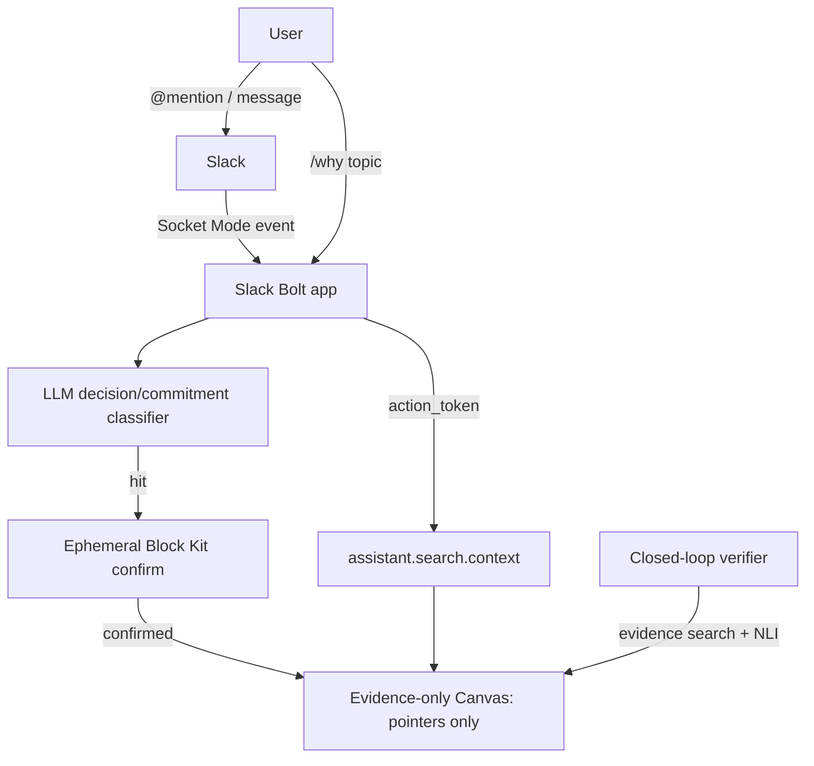

# PRD: Recorder

## Summary
Recorder is a transparent, peer-toned Slack agent that captures decisions, commitments, and blockers at the moment they're spoken, stores only evidence pointers (not content) in a Slack Canvas, and verifies later whether commitments were followed through. Full research/rationale: `docs/Intitial-research.md`.

## Principles
1. Evidence-only storage — never store raw message text or a synthesized summary; store permalink + `ts` + channel id only.
2. Capture in-flow, retrieve in-flow — no separate wiki/destination; capture via ephemeral one-tap confirm, retrieve via `/why [topic]` inside Slack.
3. Transparent, not disguised — the agent is an obvious bot with a senior-dev-peer persona (conscientious, concise, sparing wit), never impersonating a human.
4. Build as an internal app — avoids Tier 1 history rate limits and Marketplace review overhead for the MVP.

## Users
| User | Goal | Pain |
|------|------|------|
| Team member | Get a decision/commitment logged without leaving the thread | Wikis/ADRs are a separate destination task that gets skipped |
| Team member (later) | Find why a past decision was made | Rationale is buried in scattered threads, unsearchable |
| Team member (later) | Know if a stated commitment actually happened | Open loops — people say things but nothing verifies follow-through |

## Build context
- **Timeline: hackathon, 10-day budget.** Optimize for one complete, demoable loop over incremental safety. Cut M2/M3 first if time runs short — never ship M1a/M1b half-done.
- **LLM provider: Google Gemini** (chosen over Claude/OpenAI for hackathon budget — generous free tier).
- **Slack workspace: sandbox exists, not yet configured.** Agents & AI Apps feature, `search:read.*` scopes, and the `action_token` round-trip are unverified — this is M0, and it blocks M1b.

## MVP Scope
The real MVP is **M1a** (capture, no retrieval) — see Roadmap below for the full milestone breakdown. The starter `app_mention` → "hello" handshake and `/health` endpoint are done and were only ever a plumbing smoke test, not a milestone.

In (M0 + M1a, next up):
- Platform de-risk: Agents & AI Apps enabled, `search:read.*` scopes granted, one proven `action_token` → `assistant.search.context` round-trip.
- Gemini-based decision/commitment classifier on incoming messages.
- Ephemeral Block Kit confirm step (one-tap, author-only).
- Pointer record written to an evidence-only Canvas on confirm.

Out (later milestones, not yet built):
- `/why [topic]` retrieval via `assistant.search.context` (Real-time Search) — M1b.
- Closed-loop commitment verifier (scheduled follow-up + NLI evidence check) — M2.
- Repeat-question clustering, bus-factor graph, contradiction detector — M3 (pick one, stretch only).

## Requirements
1. Bot responds to `app_mention` in under a few seconds (current: static "hello" reply). *(done)*
2. `/health` returns `{"status": "ok"}` for uptime checks. *(done)*
3. **M0**: `app_mention` event yields a usable `action_token`, and a test call to `assistant.search.context` with it succeeds.
4. **M1a**: on high-confidence Gemini classification of a decision/commitment, post an ephemeral in-thread confirm; on confirm, write a pointer record (permalink + `ts` + channel id + type + owner + confidence — never message text) to the Canvas.
5. **M1b**: `/why [topic]` returns ranked permalinks pulled live via RTS, triggered through an `app_mention`/DM (for the required `action_token`) rather than a slash command.
6. **M2**: for confirmed commitments, schedule a follow-up; verify via evidence search + NLI entailment before nudging; mark kept/overdue/superseded/forgotten.
7. **M3**: implement exactly one of repeat-question clustering / bus-factor heuristic / contradiction detector, whichever is cheapest given what M1/M2 already built.

## Architecture

## Success Metrics
- % of detected decisions/commitments that get confirmed (not dismissed).
- `/why` query → useful result rate.
- % of confirmed commitments later verified as kept vs. forgotten.

## Roadmap
| # | Milestone | Scope | Est. |
|---|-----------|-------|------|
| M0 | Platform de-risk | Enable Agents & AI Apps on the existing sandbox, request granular `search:read.public`/`search:read.private` scopes, prove the `action_token` round-trip (`app_mention` → `assistant.search.context` succeeds). Blocking for M1b. | ~1 day |
| M1a | Capture (**MVP**) | Gemini classifier on incoming messages → ephemeral Block Kit confirm (one-tap, author-only) → pointer record written to the Canvas on confirm. No retrieval yet. | ~2–3 days |
| M1b | Retrieval | `/why [topic]` via `app_mention`/DM (for `action_token`) → RTS query → ranked permalinks pulled live. Closes the loop into a full demoable product. | ~1–2 days |
| M2 | Closed-loop verifier | Schedule follow-up on confirmed commitments → verify via evidence search + NLI entailment → private nudge only if unverified → status (kept/overdue/superseded/forgotten). | ~2–3 days |
| M3 | Passive intelligence (stretch, pick one) | Repeat-question clustering OR bus-factor heuristic OR contradiction detector — whichever is cheapest given what's already built. Only attempt with days to spare. | remainder |

Full snapshot tracking per milestone: `.claude/plans/milestones.md`.
