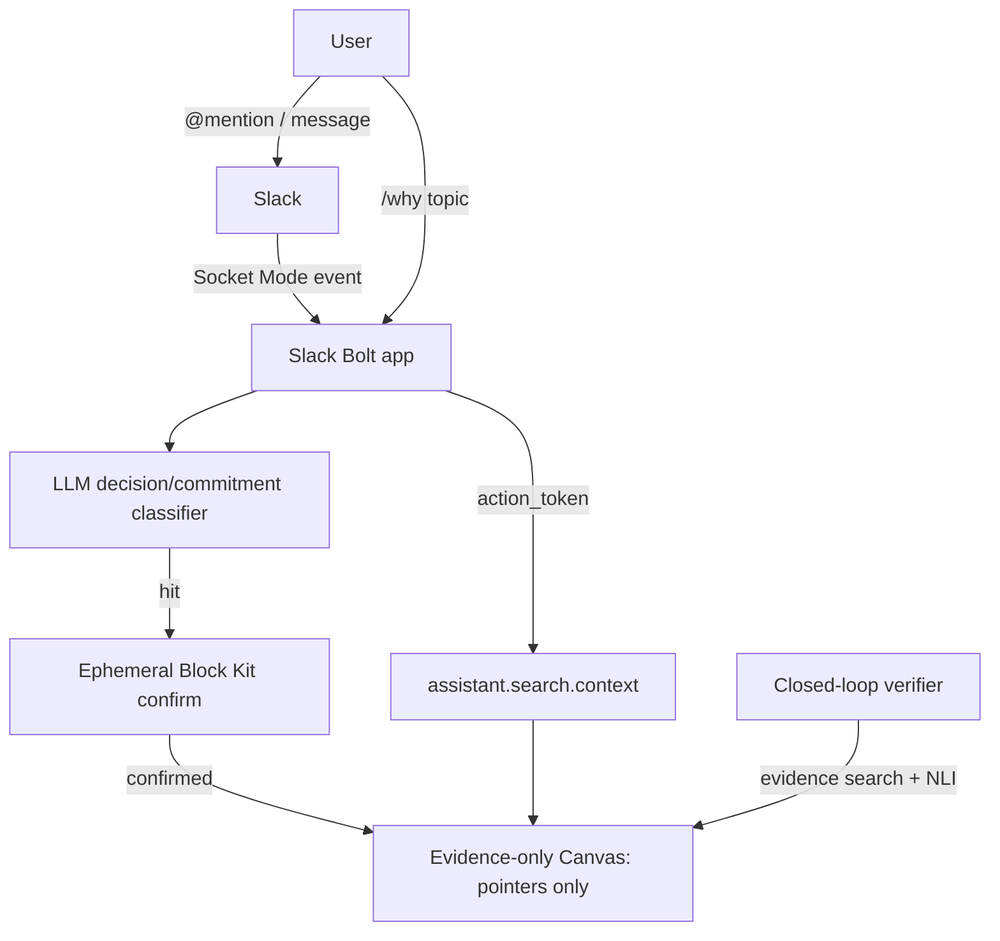

# PRD: Recorder

## Summary
Recorder is a transparent, peer-toned Slack agent that captures decisions, commitments, and blockers at the moment they're spoken, stores only evidence pointers (not content) in a Slack Canvas, and verifies later whether commitments were followed through. Full research/rationale: `docs/Intitial-research.md`.

## Principles
1. Evidence-only storage — never store raw message text or a synthesized summary; store permalink + `ts` + channel id only.
2. Capture in-flow, retrieve in-flow — no separate wiki/destination; capture via ephemeral one-tap confirm, retrieve via `/why [topic]` inside Slack.
3. Transparent, not disguised — the agent is an obvious bot with a senior-dev-peer persona (conscientious, concise, sparing wit), never impersonating a human.
4. Build as an internal app — avoids Tier 1 history rate limits and Marketplace review overhead for the MVP.

## Users
| User | Goal | Pain |
|------|------|------|
| Team member | Get a decision/commitment logged without leaving the thread | Wikis/ADRs are a separate destination task that gets skipped |
| Team member (later) | Find why a past decision was made | Rationale is buried in scattered threads, unsearchable |
| Team member (later) | Know if a stated commitment actually happened | Open loops — people say things but nothing verifies follow-through |

## MVP Scope
In:
- Slack Bolt app running in Socket Mode + FastAPI `/health` endpoint (done — starter).
- `app_mention` listener as the proof-of-life handshake (done — starter).

Out (future stages, not yet built):
- LLM decision/commitment classifier on incoming messages.
- Ephemeral Block Kit confirm step (message shortcut + one-tap capture).
- Evidence-only Canvas as the pointer store.
- `/why [topic]` retrieval via `assistant.search.context` (Real-time Search).
- Closed-loop commitment verifier (scheduled follow-up + NLI evidence check).
- Repeat-question clustering, bus-factor graph, contradiction detector.

## Requirements
1. Bot responds to `app_mention` in under a few seconds (current: static "hello" reply). *(done)*
2. `/health` returns `{"status": "ok"}` for uptime checks. *(done)*
3. Decision/commitment capture: on high-confidence LLM classification, post an ephemeral in-thread confirm; on confirm, write a pointer record to the Canvas.
4. `/why [topic]`: return ranked permalinks pulled live via RTS, triggered through an `app_mention`/DM (for the required `action_token`) rather than a slash command.
5. Verification: for confirmed commitments, schedule a follow-up; verify via evidence search + NLI entailment before nudging; mark kept/overdue/superseded/forgotten.

## Architecture

## Success Metrics
- % of detected decisions/commitments that get confirmed (not dismissed).
- `/why` query → useful result rate.
- % of confirmed commitments later verified as kept vs. forgotten.

## Roadmap
| Phase | Goal | Target |
|-------|------|--------|
| Stage 1 | De-risk platform: internal app, Agents & AI Apps feature, RTS scopes | Complete before feature code |
| Stage 2 | In-flow capture loop: classifier → ephemeral confirm → Canvas pointer → `/why` | Demo centerpiece |
| Stage 3 | Closed-loop verifier: scheduled follow-up + NLI evidence check | Differentiator |
| Stage 4 | Passive intelligence: repeat-question clustering, bus-factor, contradiction detector | As time allows |
